# Plan du site — pauseia.fr

> **Document généré.** Ne pas le modifier à la main : relancer
> `pnpm run plan-du-site`. Il est reconstruit à partir des routes,
> du menu principal, du pied de page et des articles du dépôt, donc il ne
> peut pas diverger du site.
>
> Dernière génération : 2026-10-06.

Ce document décrit le site **réel**. Le plan _souhaité_ est une décision
d'équipe et se tient ailleurs.

## En un coup d’œil

- **34 pages** (hors routes dynamiques), chacune en français et en anglais via le préfixe `/fr` ou `/en`
- **6 gabarits dynamiques** (articles, campagnes, dangers…)
- **33 articles** en Markdown dans `src/posts`
- **18 pages hors menu** : en ligne, mais qu’aucun menu ni pied de page n’atteint

## Arborescence depuis le menu principal

Les pages en pointillés sortent du site. Les pages orangées existent mais
ne sont atteignables par aucun menu.

```mermaid
flowchart LR
  accueil(["Accueil /"])
  accueil --> g0["Comprendre"]
  g0 --> n1["FAQ<br/><small>#faq</small>"]
  g0 --> n2["Ressources<br/><small>/ressources</small>"]
  g0 --> n3["Newsletter<br/><small>/newsletters</small>"]
  g0 --> n4["Blog ↗<br/><small>site externe</small>"]
  class n4 externe
  g0 --> n5["La fresque des risques de l’IA<br/><small>/fresque</small>"]
  accueil --> g1["Agir"]
  g1 --> n6["Écrire à vos élus ou à la presse<br/><small>/ecrire-a-mes-elus</small>"]
  g1 --> n7["Signer la déclaration<br/><small>/declaration</small>"]
  g1 --> n8["Participer à notre communication<br/><small>/participer-a-notre-communication</small>"]
  g1 --> n9["Agir près de chez vous<br/><small>/groupes-locaux</small>"]
  g1 --> n10["Convaincre autour de vous ↗<br/><small>site externe</small>"]
  class n10 externe
  accueil --> g2["Campagnes"]
  g2 --> n11["Toutes nos campagnes<br/><small>/campagnes</small>"]
  g2 --> n12["Au bord de la perte de contrôle<br/><small>/perte-de-controle</small>"]
  g2 --> n13["L’IA ne détruira pas QUE votre emploi<br/><small>/emploi-ia</small>"]
  accueil --> g3["Événements"]
  g3 --> n14["Colloque Sénat 2025<br/><small>/senat2025</small>"]
  g3 --> n15["Forum solutions 2025 ↗<br/><small>site externe</small>"]
  class n15 externe
  accueil --> g4["À propos"]
  g4 --> n16["Qui sommes-nous ?<br/><small>/qui-sommes-nous</small>"]
  g4 --> n17["Que demandons-nous ?<br/><small>/propositions</small>"]
  g4 --> n18["Espace presse<br/><small>/presse</small>"]
  accueil -.-> orph["Hors menu"]
  orph -.-> n19["/campagne-modele"]
  class n19 orpheline
  orph -.-> n20["/declaration/confirmer"]
  class n20 orpheline
  orph -.-> n21["/declaration/signataires"]
  class n21 orpheline
  orph -.-> n22["/emploi-ia/ce-que-lia-fait-au-travail"]
  class n22 orpheline
  orph -.-> n23["/emploi-ia/merci"]
  class n23 orpheline
  orph -.-> n24["/emploi-ia/pas-de-pilote"]
  class n24 orpheline
  orph -.-> n25["/emploi-ia/questionnaire"]
  class n25 orpheline
  orph -.-> n26["/emploi-ia/remplacer-humain"]
  class n26 orpheline
  orph -.-> n27["/g7-2026"]
  class n27 orpheline
  orph -.-> n28["/geneve-2026"]
  class n28 orpheline
  orph -.-> n29["/guide-recrutement"]
  class n29 orpheline
  orph -.-> n30["/merci"]
  class n30 orpheline
  orph -.-> n31["/municipales-2026"]
  class n31 orpheline
  orph -.-> n32["/plan-du-site"]
  class n32 orpheline
  orph -.-> n33["/posts"]
  class n33 orpheline
  orph -.-> n34["/recrutement"]
  class n34 orpheline
  orph -.-> n35["/sommet-ia-2026"]
  class n35 orpheline
  orph -.-> n36["/une-ia-sest-echappee"]
  class n36 orpheline
  classDef externe stroke-dasharray: 4 3
  classDef orpheline fill:#fff5e8,stroke:#ff9416
```

## Menu principal

### Comprendre

| Page                           | Chemin                                    |
| ------------------------------ | ----------------------------------------- |
| FAQ                            | `#faq`                                    |
| Ressources                     | `/ressources`                             |
| Newsletter                     | `/newsletters`                            |
| Blog                           | _externe_ — https://pauseia.substack.com/ |
| La fresque des risques de l’IA | `/fresque`                                |

### Agir

| Page                             | Chemin                              |
| -------------------------------- | ----------------------------------- |
| Écrire à vos élus ou à la presse | `/ecrire-a-mes-elus`                |
| Signer la déclaration            | `/declaration`                      |
| Participer à notre communication | `/participer-a-notre-communication` |
| Agir près de chez vous           | `/groupes-locaux`                   |
| Convaincre autour de vous        | _externe_ — /recrutement            |

### Campagnes

| Page                                  | Chemin               |
| ------------------------------------- | -------------------- |
| Toutes nos campagnes                  | `/campagnes`         |
| Au bord de la perte de contrôle       | `/perte-de-controle` |
| L’IA ne détruira pas QUE votre emploi | `/emploi-ia`         |

### Événements

| Page                 | Chemin                                        |
| -------------------- | --------------------------------------------- |
| Colloque Sénat 2025  | `/senat2025`                                  |
| Forum solutions 2025 | _externe_ — https://controleia.org/solutions/ |

### À propos

| Page                 | Chemin             |
| -------------------- | ------------------ |
| Qui sommes-nous ?    | `/qui-sommes-nous` |
| Que demandons-nous ? | `/propositions`    |
| Espace presse        | `/presse`          |

## Pied de page

### Navigation

| Lien                           | Chemin                                    |
| ------------------------------ | ----------------------------------------- |
| FAQ                            | `#faq`                                    |
| Propositions                   | `/propositions`                           |
| Newsletters                    | `/newsletters`                            |
| Blog                           | _externe_ — https://pauseia.substack.com/ |
| La fresque des risques de l’IA | `/fresque`                                |
| Agir                           | `/agir`                                   |
| Donner                         | `/dons`                                   |
| Nous rejoindre                 | `/rejoindre`                              |
| Qui sommes-nous ?              | `/qui-sommes-nous`                        |

### Agir

| Lien                           | Chemin                                          |
| ------------------------------ | ----------------------------------------------- |
| Écrire aux élus et à la presse | `/ecrire-a-mes-elus`                            |
| Signer la déclaration          | `/declaration`                                  |
| Rejoindre Pause IA             | `/rejoindre`                                    |
| Comment pouvez-vous aider ?    | `/agir`                                         |
| Faire un don                   | `/dons`                                         |
| Marchandises                   | _externe_ — https://pauseai-shop.fourthwall.com |
| Manifestations                 | _externe_ — https://pauseai.info/protests       |
| Offres d'emploi                | `/recrutement-emploi`                           |

### Autres

| Lien                         | Chemin                                                          |
| ---------------------------- | --------------------------------------------------------------- |
| Presse                       | `/presse`                                                       |
| Financements                 | `/financements`                                                 |
| Mentions légales             | `/mentions-legales`                                             |
| Politique de confidentialité | `/politique-de-confidentialite`                                 |
| Charte des valeurs           | `/charte-des-valeurs`                                           |
| Licence : CC-BY 4.0          | _externe_ — https://creativecommons.org/licenses/by/4.0/deed.fr |

## Pages hors menu

Ces pages sont en ligne et indexées, mais aucun menu ni pied de page n’y
mène. Soit elles méritent une entrée, soit elles sont à retirer — c’est la
matière des tâches « harmoniser menu et pied de page » et « trier les
versions anglaises ». Certaines sont normales : pages d’atterrissage de
campagne, confirmations, remerciements.

- `/campagne-modele`
- `/declaration/confirmer`
- `/declaration/signataires`
- `/emploi-ia/ce-que-lia-fait-au-travail`
- `/emploi-ia/merci`
- `/emploi-ia/pas-de-pilote`
- `/emploi-ia/questionnaire`
- `/emploi-ia/remplacer-humain`
- `/g7-2026`
- `/geneve-2026`
- `/guide-recrutement`
- `/merci`
- `/municipales-2026`
- `/plan-du-site`
- `/posts`
- `/recrutement`
- `/sommet-ia-2026`
- `/une-ia-sest-echappee`

## Gabarits dynamiques

Une seule route sert toutes les pages d’une famille ; le contenu vient de
`src/posts` ou d’une source de données.

- `/[slug]`
- `/articles/[slug]`
- `/dangers/[slug]`
- `/newsletters/[slug]`
- `/presse/local/[slug]`
- `/presse/national/[slug]`

## Articles

| Titre                                                        | Fichier                                                                        |
| ------------------------------------------------------------ | ------------------------------------------------------------------------------ |
| Passez à l’action                                            | `src/posts/agir.md`                                                            |
| Une IA s’est échappée de son test et a piraté une entreprise | `src/posts/articles/2026-08-10-incident-openai-hugging-face.md`                |
| Personne ne contrôle l’IA, le danger est imminent            | `src/posts/articles/2026-09-15-personne-ne-controle-lia.md`                    |
| Non, course et sécurité ne sont plus compatibles             | `src/posts/articles/2026-09-17-course-et-securite-ne-sont-plus-compatibles.md` |
| Charte des valeurs                                           | `src/posts/charte-des-valeurs.md`                                              |
| Dangers économiques et matériels                             | `src/posts/dangers/economiques-et-materiels.md`                                |
| Dangers pour l’humanité                                      | `src/posts/dangers/pour-l'humanite.md`                                         |
| Dangers pour la société                                      | `src/posts/dangers/pour-la-societe.md`                                         |
| Dangers pour les individus                                   | `src/posts/dangers/pour-les-individus.md`                                      |
| Take Action                                                  | `src/posts/en/agir.md`                                                         |
| An AI escaped its test and hacked a company                  | `src/posts/en/articles/2026-08-10-incident-openai-hugging-face.md`             |
| Values Charter                                               | `src/posts/en/charte-des-valeurs.md`                                           |
| Economic and Material Dangers                                | `src/posts/en/dangers/economic-and-material.md`                                |
| Dangers for Humanity                                         | `src/posts/en/dangers/for-humanity.md`                                         |
| Dangers for Individuals                                      | `src/posts/en/dangers/for-individuals.md`                                      |
| Dangers for Society                                          | `src/posts/en/dangers/for-society.md`                                          |
| FAQ                                                          | `src/posts/en/faq.md`                                                          |
| Our funding                                                  | `src/posts/en/financements.md`                                                 |
| Legal Notices                                                | `src/posts/en/mentions-legales.md`                                             |
| Privacy Policy                                               | `src/posts/en/politique-de-confidentialite.md`                                 |
| Our Proposals                                                | `src/posts/en/propositions.md`                                                 |
| Who Are We?                                                  | `src/posts/en/qui-sommes-nous.md`                                              |
| FAQ                                                          | `src/posts/faq.md`                                                             |
| Notre financement                                            | `src/posts/financements.md`                                                    |
| Mentions légales                                             | `src/posts/mentions-legales.md`                                                |
| Participer à notre communication                             | `src/posts/participer-a-notre-communication.md`                                |
| Politique de confidentialité                                 | `src/posts/politique-de-confidentialite.md`                                    |
| Que demandons-nous ?                                         | `src/posts/propositions.md`                                                    |
| Qui sommes-nous ?                                            | `src/posts/qui-sommes-nous.md`                                                 |
| Vidéos                                                       | `src/posts/videos.md`                                                          |
| Tests Wait but why                                           | `src/posts/waitbutwhy-test.md`                                                 |
| Wait But Why - IA - Partie 1                                 | `src/posts/waitbutwhy1.md`                                                     |
| Wait But Why - IA - Partie 2                                 | `src/posts/waitbutwhy2.md`                                                     |
